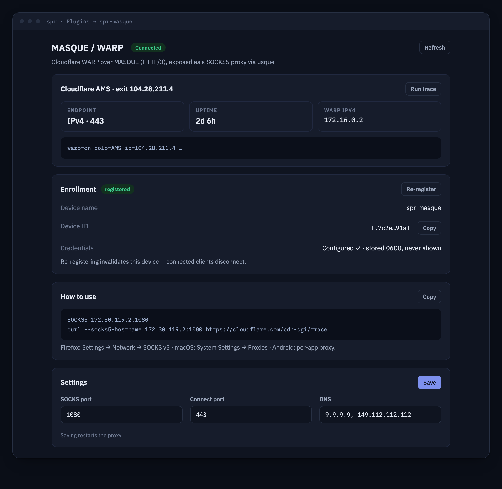

# spr-masque



Cloudflare WARP MASQUE proxy plugin for [SPR](https://github.com/spr-networks/super).

## About

spr-masque runs [usque](https://github.com/Diniboy1123/usque) — an open source
implementation of Cloudflare WARP's MASQUE protocol (HTTP/3 CONNECT-UDP over
QUIC) — inside an SPR plugin container and exposes the WARP tunnel as a
**SOCKS5 proxy** on the plugin's own docker bridge. Selected SPR devices (the
`masque` group) can route traffic through Cloudflare's network simply by
pointing a browser or app at the proxy; nothing is exposed on the host, no tun
device and no extra capabilities are needed.

The plugin integrates with the SPR UI: it ships a React frontend (built on
`@spr-networks/plugin-ui`) that SPR embeds as an iframe under Plugins, backed
by a Go API served over the plugin unix socket.

## Features

- One-click **WARP enrollment** (free account, or Zero Trust via team JWT)
- **SOCKS5 proxy mode** (TCP + UDP through the tunnel) bound to the container
  IP on the dedicated `spr-masque` bridge — never a host port
- Live **status card**: proxy state, WARP state, Cloudflare colo, exit IP,
  current MASQUE endpoint — verified end-to-end by fetching Cloudflare's
  trace URL *through* the proxy
- Settings: IPv4/IPv6 MASQUE endpoint, SOCKS port, MASQUE connect port,
  tunnel DNS servers
- **SPR topology integration** (`HasTopology`): the plugin contributes the
  Cloudflare edge it is connected through (colo + exit IP, from a live trace
  through the tunnel) to SPR's network topology view
- Credentials stored 0600 and always redacted in API responses

## UI install

1. In the SPR UI, go to **Plugins → + New Plugin** and add
   `https://github.com/spr-networks/spr-masque`
2. Open the `spr-masque` entry in the left menu
3. Press **Register with Cloudflare** (optionally set a device name or a
   Zero Trust enrollment JWT first). Registering accepts Cloudflare's WARP TOS.
4. Add devices that should use the proxy to the **`masque`** group
   (Devices → edit device → Groups)
5. On the device, configure SOCKS5 proxy = the container IP and port shown in
   the "How to use" card (default port 1080), e.g. in Firefox:
   Settings → Network Settings → Manual proxy → SOCKS Host

Verify with https://www.cloudflare.com/cdn-cgi/trace — it should report
`warp=on`.

## CLI install

```bash
cd /home/spr/super/plugins/
git clone https://github.com/spr-networks/spr-masque
cd spr-masque
./install.sh   # prompts for SUPERDIR and an SPR API token
```

Then register either from the UI or via the API:

```bash
curl --unix-socket /home/spr/super/state/plugins/spr-masque/socket.sock \
  -X POST http://localhost/register -d '{}'
```

## API

All endpoints are served on the plugin unix socket
(`/state/plugins/spr-masque/socket.sock`); SPR proxies them at
`/plugins/spr-masque/...`.

| Method | Path        | Description |
| ------ | ----------- | ----------- |
| POST   | `/register` | Run the usque register/enroll flow. Body: `{"DeviceName": "...", "JWT": "...", "Force": false}` (all optional). `JWT` enrolls into a Cloudflare Zero Trust team. Refuses with 409 if already registered unless `Force` (old credentials kept as `config.json.bak`). Registering accepts the Cloudflare TOS. |
| GET    | `/status`   | Registration + proxy state, container IP / SOCKS bind address, current endpoint, redacted device facts, and a live connectivity check (warp state, colo, exit IP) done through the proxy. |
| GET    | `/config`   | Plugin settings (no secrets stored here). |
| PUT    | `/config`   | Validate + save settings, then restart the proxy. |
| POST   | `/restart`  | Restart the usque SOCKS proxy. |
| GET    | `/trace`    | Raw Cloudflare trace text fetched through the proxy (plain text). |
| GET    | `/topology` | Plugin topology graph (`{"Nodes":[...],"Edges":[...]}`) merged by SPR into the router topology view. Always contains the `root` anchor node (`ConnType: "masque"`); when the proxy is up and a trace through the tunnel succeeds, it adds a `vpn-exit` node for the Cloudflare edge (Name = colo code, IP = WARP exit IP, Online = warp on/plus) connected to root over a `vpn` layer edge. Not registered / proxy down → root only. |

## Configuration

Settings (`GET/PUT /config`, stored at `configs/plugins/spr-masque/settings.json`):

| Field             | Default      | Meaning |
| ----------------- | ------------ | ------- |
| `EndpointVersion` | `"v4"`       | `"v4"` or `"v6"` — which Cloudflare MASQUE endpoint family to dial |
| `SocksPort`       | `1080`       | SOCKS5 listen port on the container IP |
| `ConnectPort`     | `443`        | UDP port used for the MASQUE connection |
| `DNSServers`      | `[]`         | Resolvers used inside the tunnel stack (empty = usque's Quad9 defaults) |
| `DeviceName`      | `spr-masque` | WARP device name used at registration |

WARP credentials produced by `usque register` live in
`configs/plugins/spr-masque/config.json` (usque's native layout: `private_key`,
`access_token`, `license`, endpoints, device id/IPs). The file is chmod 0600
and its secrets are never returned by the API — `/status` only reports
booleans (`HasPrivateKey`, `HasAccessToken`, `HasLicense`) plus non-secret
facts (device id, endpoints, WARP IPs).

## Security model

- **No published host ports.** The plugin API is a unix socket; the SOCKS5
  listener binds the container IP on the plugin's own bridge (`spr-masque`).
  Only SPR devices granted access via SPR policies/groups (the `masque`
  group / `NetworkCapabilities` in plugin.json) can reach it.
- **No extra capabilities.** No `NET_ADMIN`, no tun device, no sysctls,
  `no-new-privileges:true`. usque's SOCKS mode is a pure userspace network
  stack; outbound traffic is QUIC to Cloudflare (UDP/443 by default) under the
  container's `wan`+`dns` policies.
- **Credential hygiene.** WARP key material is written 0600, re-clamped at
  startup, backed up (0600) on re-registration, and redacted on every read.
- All user input is validated server-side (allow-list patterns) and passed to
  usque as argv arrays — nothing is interpolated into a shell.
- Volumes are minimal: the plugin state dir (socket), `configs/base/config.sh`
  (ro), and the plugin config dir.

## Upstream

Tunnel implementation: [Diniboy1123/usque](https://github.com/Diniboy1123/usque)
(MIT licensed), built from source at a pinned release commit. usque is an
unofficial Cloudflare WARP client; see its README for protocol details and
caveats. Cloudflare, WARP and related marks belong to Cloudflare, Inc.

## Reproducible builds

All build inputs are pinned in `reproducible.env`: base image digests, the Go
toolchains (two — the plugin builds with Go `GO_VERSION`, usque requires a
newer `USQUE_GO_VERSION`; both verified by sha256), the Ubuntu snapshot
archive timestamp, and the usque release (`USQUE_VERSION` + full
`USQUE_COMMIT` hash, verified at checkout).

- `./build_docker_compose.sh` — reproducible local/CI build (buildx +
  rewrite-timestamp, `SOURCE_DATE_EPOCH=0`)
- `./update-pins.sh` — re-resolves every pin (image digests, latest Go patch
  releases, latest usque release tag + commit) and rewrites `reproducible.env`
  and the Dockerfile ARG defaults
